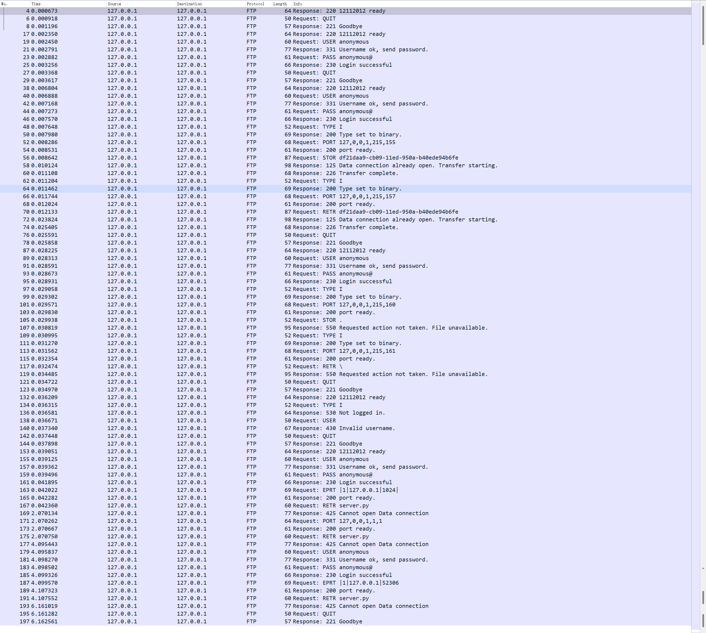
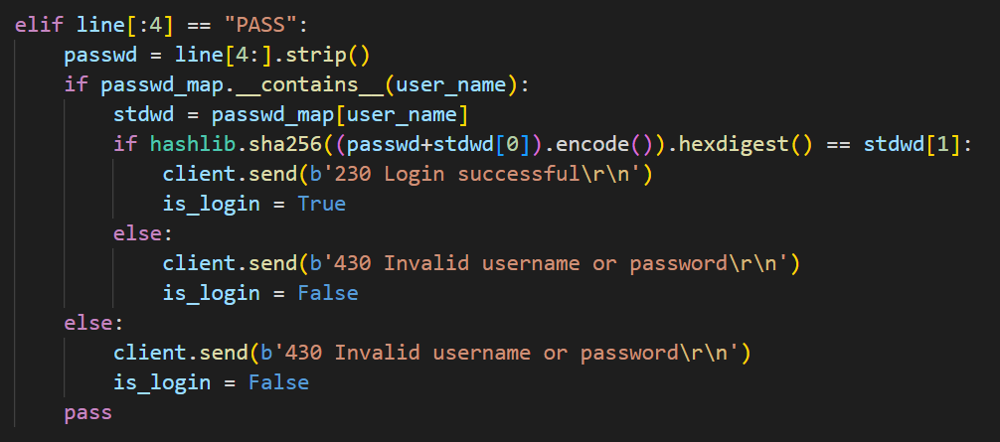
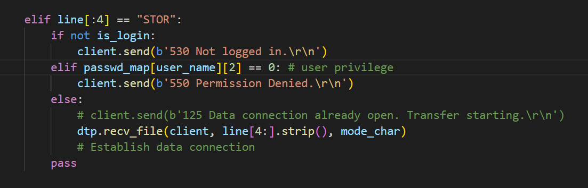
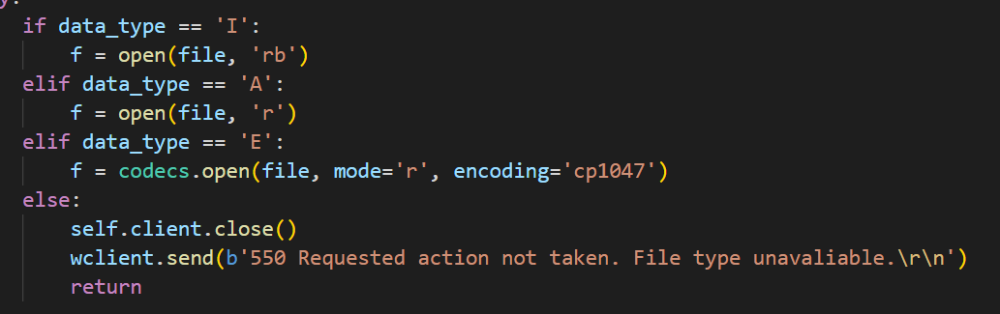
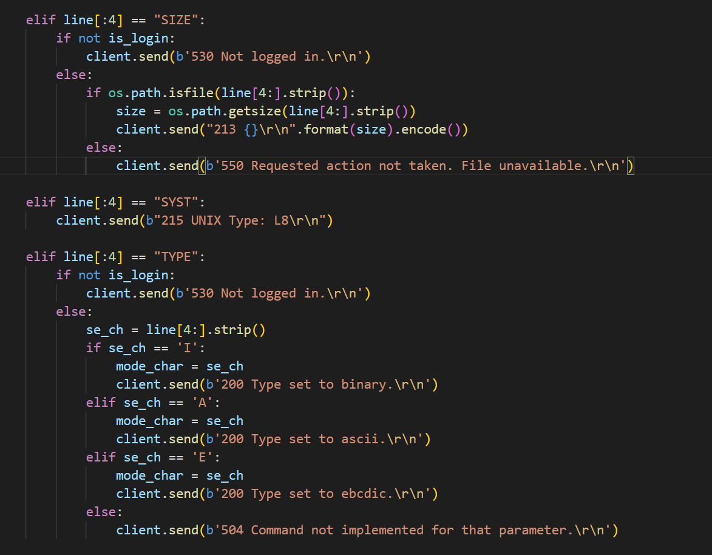
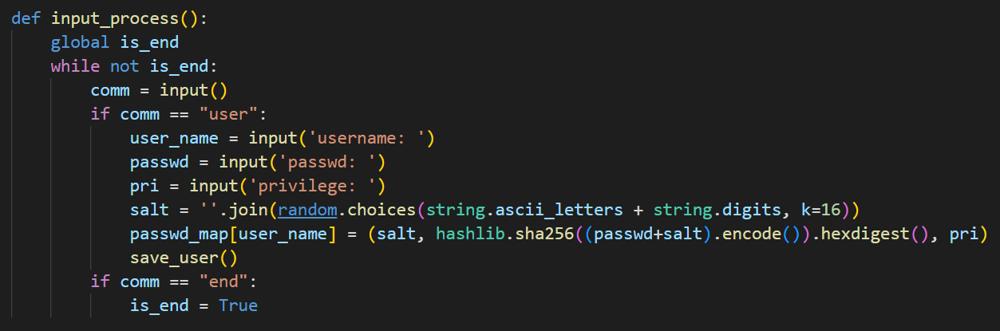

    <h1>
        CS305 Program Assignment 1
    </h1>

### Testing Script:

### Additional

#### User login contorl

In `PASS` command, I will check if the username and password match the record. A bool: `is_login` is set to be True/False. I store the username and password in a `dict` variable in memory, and a `json` file in hard disk.

To ensure the security, I give every user a random salt to encode his password with sha256.

If not login, I will not provide any file command to this user.

#### User privilege control

The `dict` that store the user will be:

`username: tuple(salt, passwd_in_sha256, privilege_bit)`

if privilege bit is 1, then he/she can store file in the server. Otherwise he/she can only download.

#### More commands

`SIZE` that return a file's size

`TYPE` that specify file transmit type. `I` for binary, `A` for ASCII, `E` for EBCDIC

`SYST` that return the system type

#### not ftp but in server

When running the server, you could input `user` to create an new user; input `end` to shutdown and close every connection.

Input_process and ftp_server are running in different thread.

